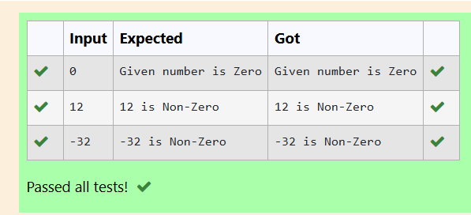

# Ex.No:1(C) CONTROL STATEMENTS

## AIM:
To develop a Java program to check given number is zero or not.

## ALGORITHM :
1.	Start the program.
2.	Declare an integer variable 'num'
3.	Create a Scanner object 'sc' to read input from the user
4.	Read an integer input from the user and store it in 'num'
5.	Check if 'num' is equal to 0:
a.	If true, print "Given number is Zero"
b.	If false, print 'num' followed by " is Non-Zero"
6.	End

## PROGRAM:
 ```
/*
Program to implement a class & objects using Java
Developed by: ANISH RAJ P
RegisterNumber:  212222230010
*/
```

## Sourcecode.java:
```
import java.util.*;
public class main{
    public static void main(String args[])
    {
            Scanner kbd=new Scanner(System.in);
            int a=kbd.nextInt();
            int res=a^0;
            if(res==0)
                System.out.print("Given number is Zero");
            else
                System.out.print(res+" is Non-Zero");
    }
}
```
## OUTPUT:



## RESULT:
Thus, the Java program to check given number is zero or not was created successfully.
