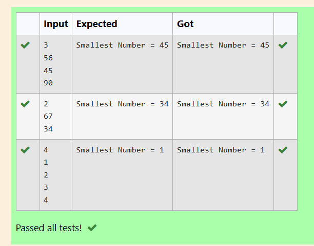

# Ex.No:2(E)  SMALLEST ELEMENT IN AN ARRAY

## AIM:
To write a Java program that reads an array size and elements from the user and then finds and prints the smallest element in the array.
## ALGORITHM :
1.	Start the program.
2.	Read the size of the array from the user.
3.	Declare an array of the given size.
4.	Read the array elements from the user.
5.	Initialize a variable min with the first element of the array.
6.	Traverse the array using a loop.
7.	Compare each element with min. If an element is smaller, update min.
8.	After the loop ends, print the smallest number.
9.	End the program.
	
## PROGRAM:
 ```
/*
Program to implement a Smallest Element in an Array
Developed by: ANISH RAJ P
RegisterNumber: 212222230010 
*/
```

## Sourcecode.java:
```
import java.util.Scanner;
public class Main
{
   public static void main(String[] args)
   {
      int tot, i, small;
      Scanner scan = new Scanner(System.in);
      tot = scan.nextInt();
      int[] arr = new int[tot];
      for(i=0; i<tot; i++)
         arr[i] = scan.nextInt();
      
      small = arr[0];
      for(i=1; i<tot; i++)
      {
         if(small>arr[i])
            small = arr[i];
      }
      
      System.out.println("Smallest Number = " +small);
   }
}
```

## OUTPUT:


## RESULT:
Thus the java program successfully reads the array size and elements from the user and correctly finds and prints the smallest number in the array.
